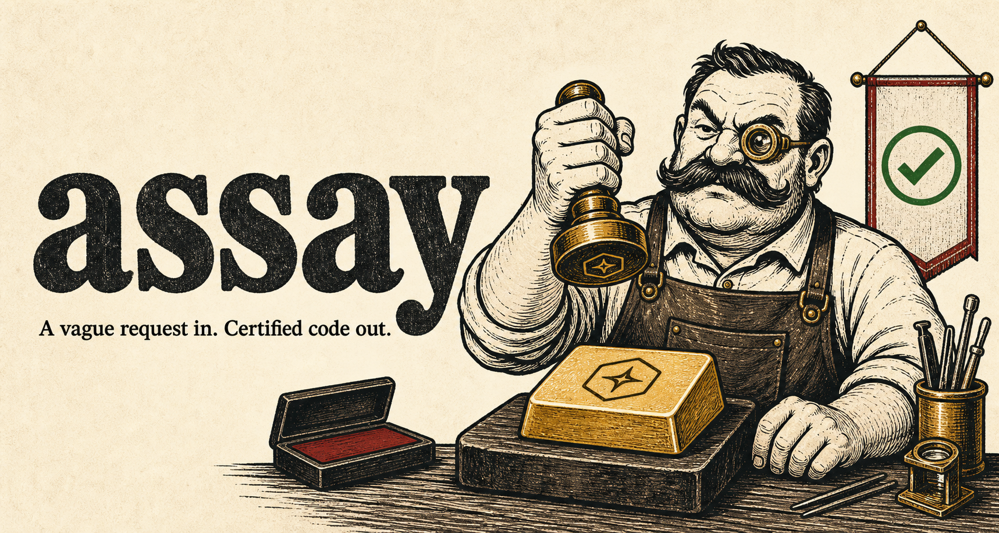
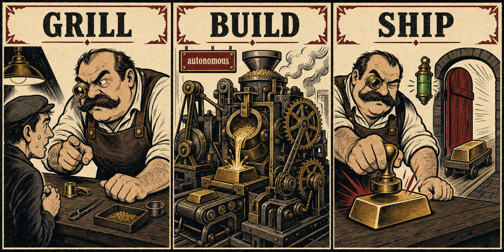
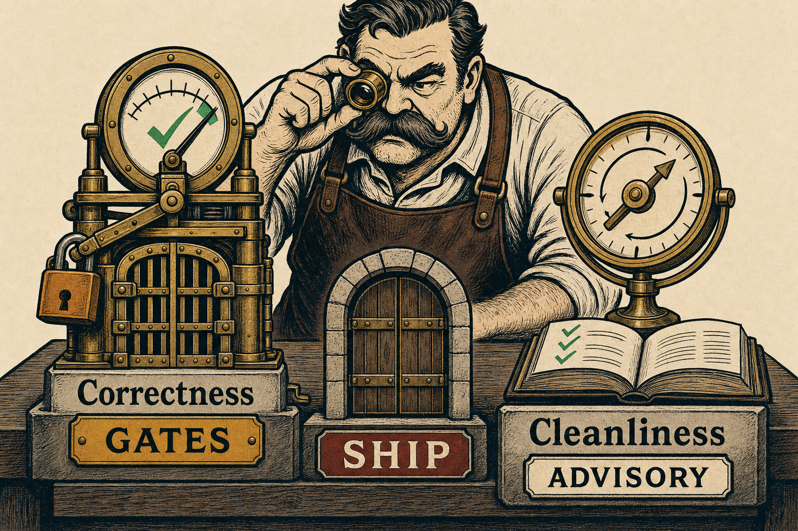
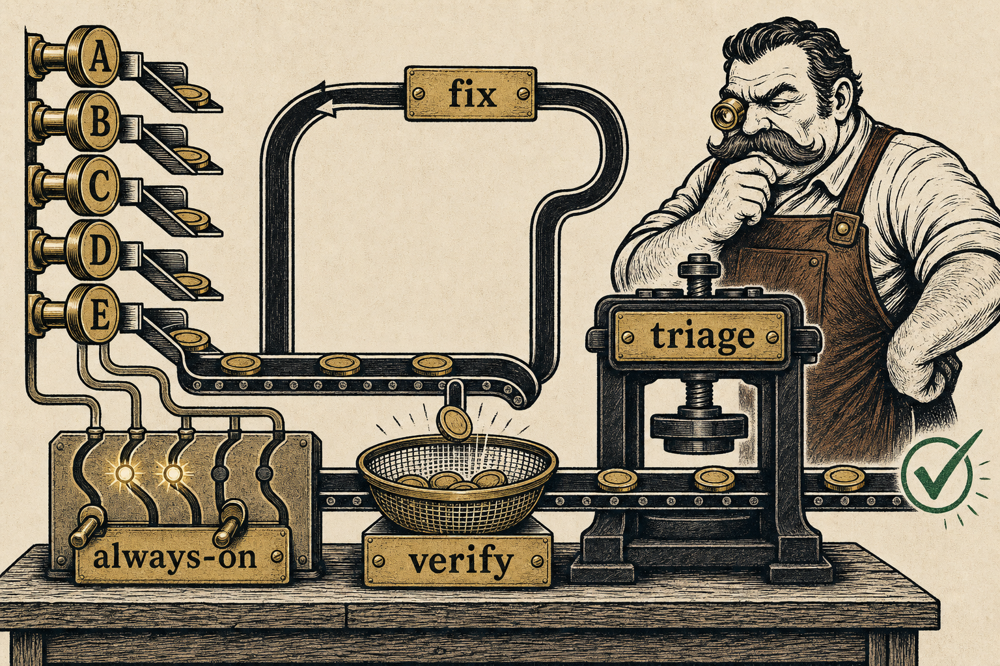

<div align="center">



**A vague request in. Certified code out.**

A [Claude Code](https://claude.com/claude-code) skill that turns *any* unit of work — a freeform feature
request or a Jira / Linear / GitHub ticket — into reviewed, tested, idiomatic, merge-ready code, by running
the full delivery loop end to end and refusing to call it done until the machine agrees.

</div>

---

## The idea

Most "agent builds a feature" attempts fail the same two ways: the agent guesses at ambiguous requirements,
or it declares victory while bugs and tech debt remain. assay closes both holes with one move:

> **Resolve every ambiguity up front with an interview, then run an autonomous build that converges on
> correctness+completeness behind a machine gate — and treats code-cleanliness as advice, not a gate.**

A human is in the loop in **exactly two places** — the grilling at the start, and a confirmation before
anything outward (commit / PR / ticket write) at the end. Everything in between is autonomous and
structurally gated — and the loop won't burn tokens re-checking work that's already clean.

It's a **universal orchestrator**: it detects the project it runs in and adapts. Backend, frontend,
full-stack, mobile (incl. Flutter), CLI, library, or infra; monolith or microservices; one repo or a
feature spanning several — same skill, no hardcoded stack.

---

## How it works — three stages

<div align="center">

</div>

| Stage | Who | What happens |
|---|---|---|
| **1 · Intake & Grill** | 🧑 human | Pull context, run [`grill-me`](#whats-in-the-box) to interview the request to **zero ambiguity** (scope, repos touched, whether each builds today, the contracts, testable criteria) — and, since you're already reading the repo, **detect the `ProjectProfile` here** (stack, the real gate commands from CI, conventions). Synthesize a lean **PRD** (pure *what*, not *how*) with **EARS** criteria, saved to `.prd/<slug>.md`. |
| **2 · Workflow** | 🤖 autonomous | One Workflow runs **Plan → Research → Implement → ⟲ Converge → Polish → Ship-gate**. No `Adapt` phase — the profile came from intake. It can't stop to ask — that's *why* the grill comes first. |
| **3 · Confirm & Ship** | 🧑 human | Present the structured `ShipVerdict` (with its advisory simplifications ledger). Only with an explicit go: commit / push / open a PR, and write back to the ticket. `blocked` / `needs-human` stop here — and `needs-human` **resumes** the Workflow, it doesn't restart. |

The grill is load-bearing: a Workflow phase-agent can't pause to ask the user anything mid-run, so **every
ambiguity has to die before the Workflow starts.** That single constraint is what buys the autonomy.

---

## Two clocks: gate correctness, advise on cleanliness

<div align="center">

</div>

Correctness and completeness *converge fast and must gate*; maintainability/DRY is *bottomless and must not
gate*. Jamming both into one loop makes a copy-pasted helper hold the whole machine for another expensive lap.
So assay runs **two clocks**:

- **Mechanism A — Converge (blocks ship).** A loop of **Review → Triage → Fix → Gate** where **the script, not
  a model, decides whether to loop again.** Finders mirror the current `/code-review` A–E correctness angles
  (always-on) + SMART-selected specialists, then a 3-state recall-biased verify drops only provably-wrong
  candidates before triage. It exits when triage-accepted `== 0`, the tiered gates are green, and the
  **AC-tagged tests** pass. Then it stops.
- **Mechanism B — Polish (advisory, one pass).** `thermo-nuclear` + `yagni` + `efficiency` + `conventions` + doc-drift on the full diff, once.
  Cheap DRY wins get applied; everything else lands in a **simplifications ledger** on the verdict. **It never
  blocks ship.**

What keeps Mechanism A both rigorous *and* cheap:

- **Triage is the gate, never a score — and it has memory.** Only *new* findings reach triage; a dispositioned
  finding never re-enters (so the loop can't re-litigate the same nit, or re-accept one it earlier rejected).
- **Review the delta, not the world.** Pass 1 is the focused fan-out; pass 2+ reviews **only the files the last
  fix changed**, with **only the lenses whose surface those files touch.**
- **The gate is mechanical and N/A-aware.** Real commands run; the **script** computes `green`. A command that
  doesn't exist is `not-applicable` (never blocks); a tier-0 command the env can't run is `failed` (never
  silently green). Completeness is the **AC-tagged tests**, not a re-judged opinion.
- **The diff is re-derived from git each pass**; hitting the convergence cap returns a **`blocked`** verdict
  with residuals — never a silent green.

<div align="center">

</div>

The review engine itself mirrors the current `/code-review` at the script level: **five always-on correctness
angles (A–E)** + **smart-selected specialists** (a fail-safe surface floor a cheap router can only widen) →
a **3-state verify** sieve that drops only the provably-wrong → **triage, the gate** → **fix**, then loop.

---

## Universal by design — detect & adapt

<div align="center">

</div>

Nothing downstream hardcodes a stack. The `ProjectProfile` is detected **at intake** (not a separate phase) —
stack, package manager, the *real* gate commands (**reading CI as the source of truth**), which commands
actually exist, conventions, and the work's **surfaces** (api, ui, db, infra, async, library). Surfaces select
the review lenses and the gates:

| Surface | Adds lenses | Adds gates |
|---|---|---|
| api | `api-contract` | contract tests if present |
| ui | — | build + boot/route smoke |
| db | `data-integrity` | integration if present |
| infra | `infra-safety` | plan/dry-run if present |
| *multi-repo* | `integration` (cross-target contract conformance) | contract/e2e across targets |

**A lens is only as reliable as its oracle.** The gate keeps the lenses that judge the code against *execution
semantics* (the `angle-A`…`angle-E` correctness core, `api-contract`, `security`, `data-integrity`, `concurrency`)
and **drops the ones anchored on lagging artifacts** — `prior-prs` (unrelated/hallucinated in a team),
`code-comments` (comments rot), and `claude-md` *as a gate* (docs lag the code); `a11y`/`visual-state`/`git-history`
are cut entirely. Convention-following moves to **prevention** (Implement mirrors the sibling code; the code wins
over CLAUDE.md); reverse-direction doc drift and forward-direction `conventions` (quote-the-exact-rule) become
advisory Mechanism-B notes, never gate findings.

For multi-repo work it plans **contract-first**: freeze the seam, then build each side against the frozen
contract in parallel. A single-repo feature collapses that machinery away cleanly — the same script handles
"add a button" and "ship a feature across three services."

---

## What's in the box

The whole skill stack is **bundled under [`.skill/`](.skill)** so it installs in one move — assay plus
the four skills it hard-depends on.

| Bundled in `.skill/` | Role |
|---|---|
| `assay` | the orchestrator |
| `grill-me` + `grilling` | the requirements interview that kills ambiguity up front |
| `workflow-review-phase` | the review→triage→fix segment spliced into Mechanism A |
| `thermo-nuclear-code-quality-review` | the maintainability lens (Mechanism B, advisory) |

Two dependencies are **referenced, not bundled** — install them separately:

- **Context7** — an MCP (`mcp__plugin_context7_context7__*`) for current best-practice docs of the libraries
  actually in use. Add it to your MCP config.
- **`/code-review`** — Anthropic's official Claude Code plugin (whose CURRENT angles + 3-state verify
  `workflow-review-phase` MIRRORS at the script level). It ships with Claude Code, so it's not redistributed here.

Everything else (Pact, Specmatic, other skill ecosystems) is **detect-and-use-if-present**, never installed —
over-skilling bloats every session and causes mis-triggering.

## Install

```bash
git clone https://github.com/HabibPro1999/assay.git
cp -R assay/.skill/* ~/.claude/skills/   # install assay + its bundled deps
```

assay is `disable-model-invocation: true` — **the user** starts it with `/assay`; the model can't
auto-launch it. Invoke it to *build, implement, ship, deliver, or finish* a feature, or to work a ticket end
to end (e.g. `"build the X feature"`, `"work ABC-123"`, `"take this to a merge-ready PR"`).

## Requirements

The autonomous stage runs as a Claude Code **Workflow**, so it needs:

- **Claude Code ≥ 2.1.154** on a **paid plan** — the Workflow tool (`agent()` / `parallel()` / `pipeline()` /
  `phase()`) is GA there.
- **Context7** configured as an MCP server — current library docs during Research.
- **`/code-review`** available — it ships with Claude Code.

Below that version or on a free plan the Workflow won't launch, so assay **degrades rather than fails**: it
can drive the same flow from a single top-level orchestrator agent (nested subagents shipped in v2.1.172), trading
the *script-decided* gate for a model-judged one. The build still ships; the verdict says which path ran.

## Cost & expectations

This is a **heavyweight orchestrator, not a quick edit**. A large multi-repo build can run into the millions of
tokens and tens of minutes — the two-clocks design exists precisely to stop the loop burning tokens re-checking
clean code, but the floor is still an Opus-heavy plan / implement / review stack. It earns its cost on real units
of work (a ticket, a feature); for a one-line change, use a plain prompt instead. Cost scales down on its own for
small single-repo tasks (surface-gating runs fewer lenses, delta laps shrink), and the model tiers are a *prior*
you can dial cheaper for low-blast-radius work. The load-bearing guardrails live in
[`SKILL.md`](.skill/assay/SKILL.md#guardrails-load-bearing--keep-them).

## Repo layout

```
assay/
├── README.md
├── assets/                                  # the diagrams above
└── .skill/                                  # the installable bundle
    ├── assay/
    │   ├── SKILL.md                         # the orchestrator: the shape, the two clocks, the guardrails
    │   └── references/
    │       ├── intake-and-spec.md           # grill handoff, profile detection, PRD + EARS + AC→test
    │       ├── adaptation-layer.md          # detection, CI-as-truth, oracle-ranked lenses, the gate
    │       ├── canonical-workflow.md        # the v2 template: CONFIG + frozen mechanism + schemas
    │       └── multi-repo-contracts.md      # contract-first planning across repos/services
    ├── grill-me/ · grilling/                # the requirements interview
    ├── workflow-review-phase/               # the spliced review→triage→fix segment
    └── thermo-nuclear-code-quality-review/  # the maintainability lens
```

## Credits & prior art

assay stands on the shoulders of **[Matt Pocock](https://github.com/mattpocock)** and his
[`mattpocock/skills`](https://github.com/mattpocock/skills) ("Skills for Real Engineers"). Several patterns
encoded here are reactions to — and refinements of — his skills: assay writes its own *product* PRD
rather than the *technical* one his [`to-prd`](https://github.com/mattpocock/skills) produces (so planning
happens once, in the Workflow), and it folds the spirit of his `tdd` (red-green-refactor) and
`diagnosing-bugs` (reproduce → root-cause → regression-test) loops directly into the implement and review
stages instead of pulling them in as separate skills. Credit where due — go star his repo.

It also borrows from **[ponytail](https://github.com/DietrichGebert/ponytail)** ("the laziest senior dev in
the room") — again *encoded, not bundled*: its YAGNI ladder becomes the lazy-build clause in the Implement
phase, its over-engineering review becomes the `yagni` lens, and its `ponytail:` shortcut marker + debt ledger
become a `simplifications` field on the `ShipVerdict` so deliberate, accepted shortcuts get tracked instead of
silently rotting.

## License

[MIT](LICENSE)
