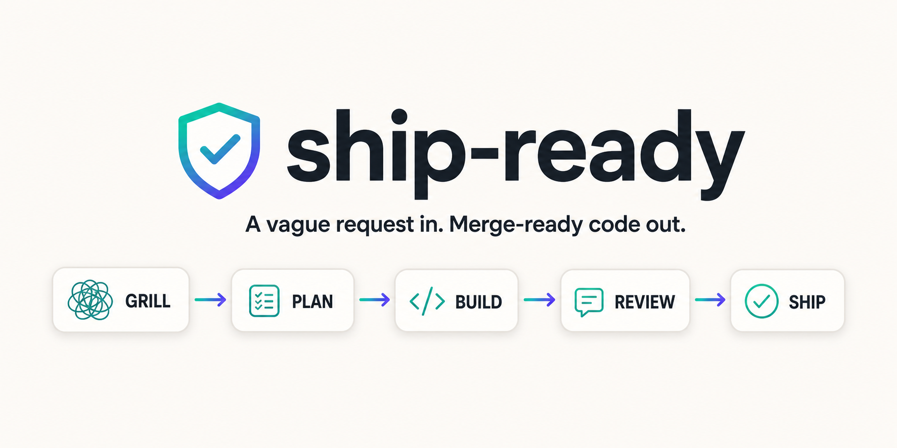
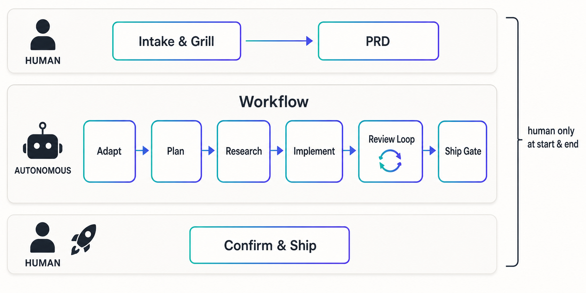
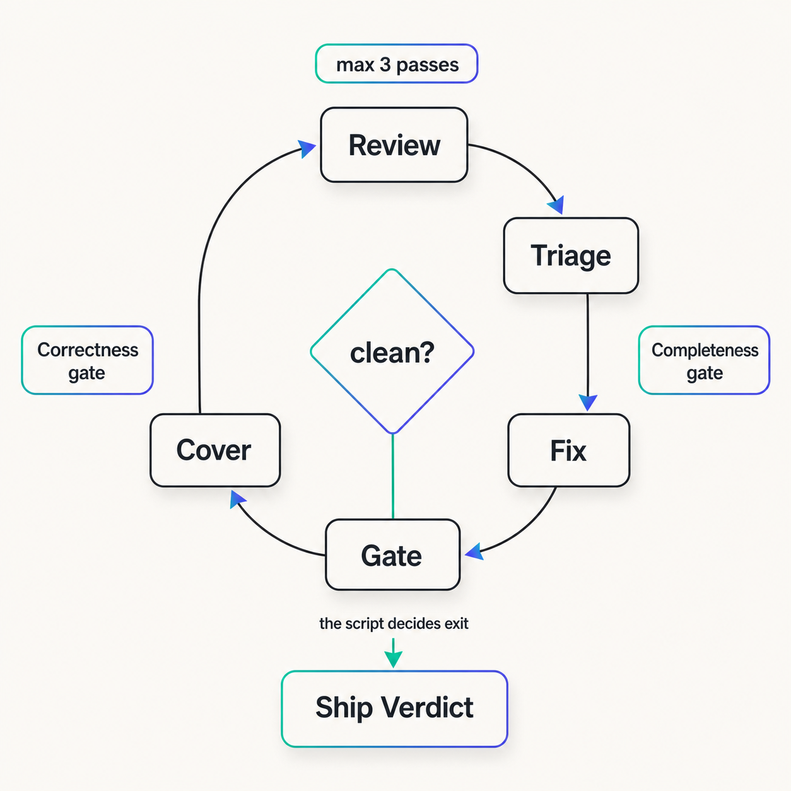
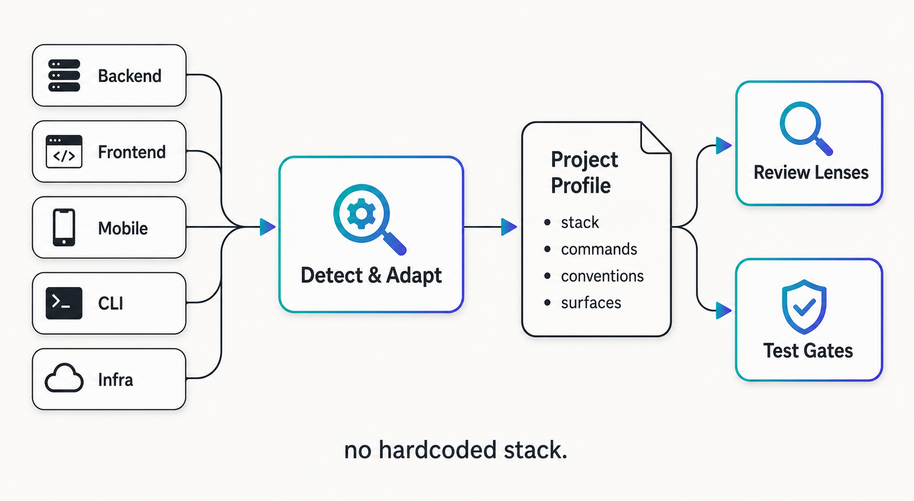

<div align="center">



**A vague request in. Merge-ready code out.**

A [Claude Code](https://claude.com/claude-code) skill that turns *any* unit of work — a freeform feature
request or a Jira / Linear / GitHub ticket — into reviewed, tested, idiomatic, merge-ready code, by running
the full delivery loop end to end and refusing to call it done until the machine agrees.

</div>

---

## The idea

Most "agent builds a feature" attempts fail the same two ways: the agent guesses at ambiguous requirements,
or it declares victory while bugs and tech debt remain. ship-ready closes both holes with one move:

> **Resolve every ambiguity up front with an interview, then run a single autonomous loop that cannot
> declare victory until a machine-checked gate says it's clean — on *both* correctness and completeness.**

A human is in the loop in **exactly two places** — the grilling at the start, and a confirmation before
anything outward (commit / PR / ticket write) at the end. Everything in between is autonomous and
structurally gated.

It's a **universal orchestrator**: it detects the project it runs in and adapts. Backend, frontend,
full-stack, mobile (incl. Flutter), CLI, library, or infra; monolith or microservices; one repo or a
feature spanning several — same skill, no hardcoded stack.

---

## How it works — three stages

<div align="center">

</div>

| Stage | Who | What happens |
|---|---|---|
| **1 · Intake & Grill** | 🧑 human | Pull context from the ticket/request, then run [`grill-me`](#whats-in-the-box) to interview the request to **zero ambiguity** — scope, the repos/services touched, whether each one actually builds today, the contracts between them, and testable acceptance criteria. Synthesize a lean **PRD** (pure *what*, not *how*) with criteria in **EARS** form and save it to `.prd/<slug>.md`. |
| **2 · Workflow** | 🤖 autonomous | One Workflow runs **Adapt → Plan → Research → Implement → ⟲ Review-loop → Ship-gate**. It can't stop to ask a question — that's *why* the grill comes first. |
| **3 · Confirm & Ship** | 🧑 human | Present the structured `ShipVerdict`. Only with an explicit go: commit / push / open a PR, and write back to the ticket. |

The grill is load-bearing: a Workflow phase-agent can't pause to ask the user anything mid-run, so **every
ambiguity has to die before the Workflow starts.** That single constraint is what buys the autonomy.

---

## The loop that makes "no bugs, no debt" real

<div align="center">

</div>

The heart of the rigor is a loop — **Review → Triage → Fix → Gate → Cover** — where **the script, not a
model, decides whether to loop again.** Letting a model judge "are we done?" invites optimism; it'll call a
90%-done change shipped. So the harness computes `clean` from objective signals across two axes:

- **Correctness** — triage accepted findings `== 0` **and** the tiered gates are green.
- **Completeness** — every EARS acceptance criterion in the PRD is satisfied (read back from the file and
  reconciled against the diff each pass).

Key invariants:

- **Triage is the gate, never a confidence score** — a score floor lets the weakest agent silently kill a
  real finding before the strongest one sees it.
- **Gates actually run, and a skipped gate is never reported green** — every gate is enumerated as
  ran / passed / failed / skipped-and-why; `green` is computed by the script, not asserted by a model.
- **The diff is re-derived from git each pass** — fix-agents sometimes mis-report what they changed.
- Capped at ~3 passes; on hitting the cap it returns a **`blocked`** verdict listing residuals — never a
  silent green.

---

## Universal by design — detect & adapt

<div align="center">

</div>

Nothing downstream hardcodes a stack. The **Adapt** phase profiles each repo — stack, package manager, the
*real* test/lint/build/format commands (**reading CI as the source of truth**), conventions, and the work's
**surfaces** (api, ui, db, infra, async, library). Those surfaces select the **review lenses** that fan out
and the **test gates** that must pass:

| Surface | Adds lenses | Adds gates |
|---|---|---|
| api | `api-contract` | contract tests if present |
| ui | `a11y`, `visual/state` | build + boot/route smoke |
| db | `data-integrity` | integration if present |
| infra | `infra-safety` | plan/dry-run if present |
| *multi-repo* | `integration` (cross-target contract conformance) | contract/e2e across targets |

For multi-repo work it plans **contract-first**: freeze the seam between services, then build each side
against the frozen contract in parallel. A single-repo feature collapses all of that machinery away cleanly —
the same script handles "add a button" and "ship a feature across three services."

---

## What's in the box

The whole skill stack is **bundled under [`.skill/`](.skill)** so it installs in one move — ship-ready
plus the four skills it hard-depends on, and `imagegen` (used to draw these diagrams).

<div align="center">

</div>

| Bundled in `.skill/` | Role |
|---|---|
| `ship-ready` | the orchestrator |
| `grill-me` + `grilling` | the requirements interview that kills ambiguity up front |
| `workflow-review-phase` | the review→triage→fix segment spliced into the loop |
| `thermo-nuclear-code-quality-review` | the maintainability/abstraction lens |
| `imagegen` | generates the explanatory diagrams (handy, not a runtime dep) |

Two dependencies are **referenced, not bundled** — install them separately:

- **Context7** — an MCP (`mcp__plugin_context7_context7__*`) for current best-practice docs of the libraries
  actually in use. Add it to your MCP config.
- **`/code-review`** — Anthropic's official Claude Code plugin (the engine `workflow-review-phase` reproduces).
  It ships with Claude Code, so it's not redistributed here.

Everything else (Pact, Specmatic, other skill ecosystems) is **detect-and-use-if-present**, never installed —
over-skilling bloats every session and causes mis-triggering.

## Install

```bash
git clone https://github.com/HabibPro1999/ship-ready.git
cp -R ship-ready/.skill/* ~/.claude/skills/   # install ship-ready + its bundled deps
```

ship-ready is `disable-model-invocation: true` — **the user** starts it with `/ship-ready`; the model can't
auto-launch it. Invoke it to *build, implement, ship, deliver, or finish* a feature, or to work a ticket end
to end (e.g. `"build the X feature"`, `"work ABC-123"`, `"take this to a merge-ready PR"`).

## Guardrails (load-bearing — don't remove)

- **Grill first, always** — no skipping to implementation, however clear the request looks.
- **Triage is the gate, never a threshold.**
- **Re-derive the diff from git each pass.**
- **Never report green on a skipped gate** — and `green` is computed by the script, never asserted.
- **A non-building repo is never done** — a missing import / config is in-scope work, surfaced at intake.
- **`needs-human` is first-class** — it resumes the Workflow, it doesn't restart it.
- **Confirm before any outward write** — commit, push, PR, ticket comment, status transition.

## Repo layout

```
ship-ready/
├── README.md
├── assets/                                  # the diagrams above
└── .skill/                                  # the installable bundle
    ├── ship-ready/
    │   ├── SKILL.md                         # the orchestrator: the shape, the gate, the guardrails
    │   └── references/
    │       ├── intake-and-spec.md           # grill handoff, ticket adapters, PRD + EARS criteria
    │       ├── adaptation-layer.md          # project detection, CI-as-truth, surface→lens, gates
    │       ├── canonical-workflow.md        # the Workflow script template + schemas + model tiers
    │       └── multi-repo-contracts.md      # contract-first planning across repos/services
    ├── grill-me/ · grilling/                # the requirements interview
    ├── workflow-review-phase/               # the spliced review→triage→fix segment
    ├── thermo-nuclear-code-quality-review/  # the maintainability lens
    └── imagegen/                            # diagram generation
```

## Credits & prior art

ship-ready stands on the shoulders of **[Matt Pocock](https://github.com/mattpocock)** and his
[`mattpocock/skills`](https://github.com/mattpocock/skills) ("Skills for Real Engineers"). Several patterns
encoded here are reactions to — and refinements of — his skills: ship-ready writes its own *product* PRD
rather than the *technical* one his [`to-prd`](https://github.com/mattpocock/skills) produces (so planning
happens once, in the Workflow), and it folds the spirit of his `tdd` (red-green-refactor) and
`diagnosing-bugs` (reproduce → root-cause → regression-test) loops directly into the implement and review
stages instead of pulling them in as separate skills. Credit where due — go star his repo.

It also borrows from **[ponytail](https://github.com/DietrichGebert/ponytail)** ("the laziest senior dev in
the room") — again *encoded, not bundled*: its YAGNI ladder becomes the lazy-build clause in the Implement
phase, its over-engineering review becomes the `yagni` lens, and its `ponytail:` shortcut marker + debt ledger
become a `simplifications` field on the `ShipVerdict` so deliberate, accepted shortcuts get tracked instead of
silently rotting.

## License

[MIT](LICENSE)
